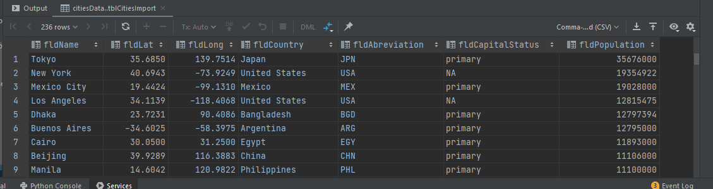
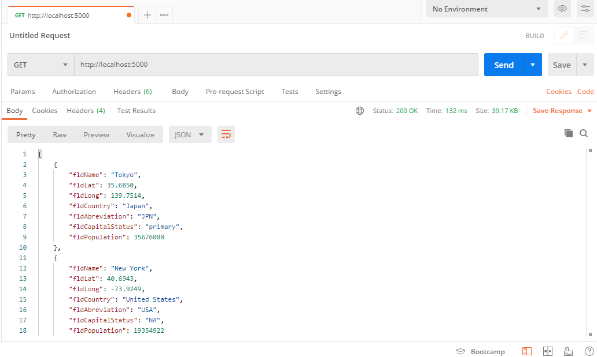
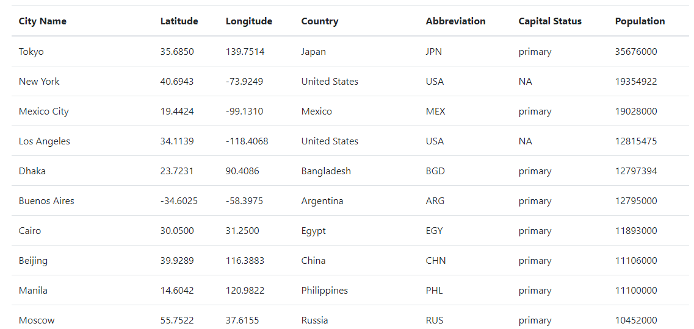
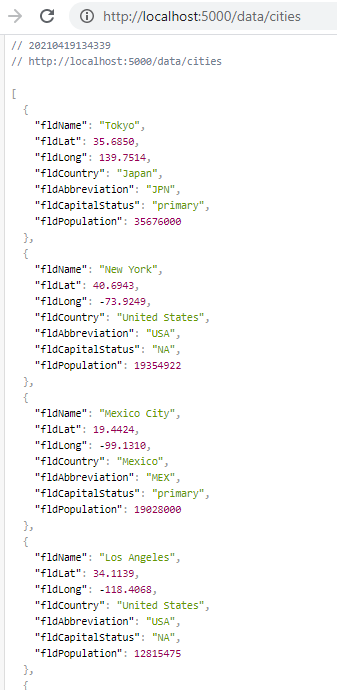
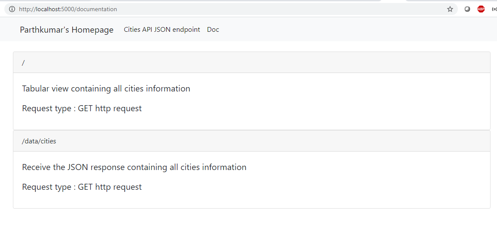

## Homework: Web Application Part 2
**Student** : Parthkumar Anilkumar Gandhi

## About:
This is course assignment for setting up MySQL, Flask and Docker env in PyCharm editor.

## Table view

## Postman GET request, JSON response received

## Rendered cities info to HTML page, presenting in tablular form

## Cities data in JSON format (/data/cities)

## Added Documentation Page

